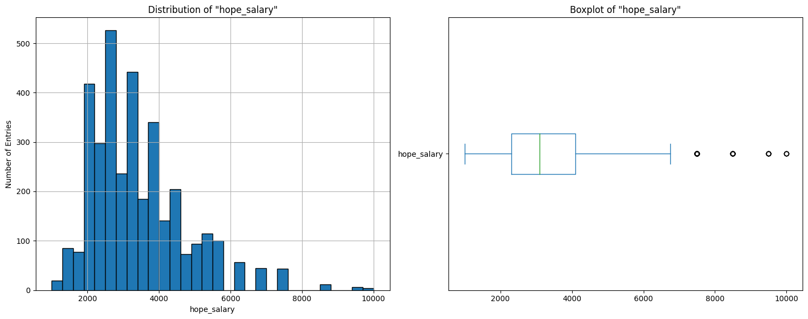
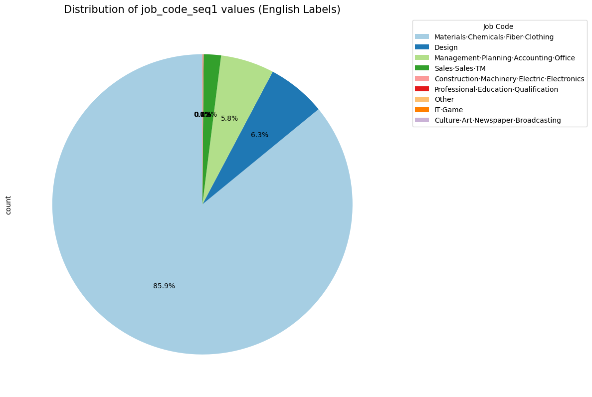
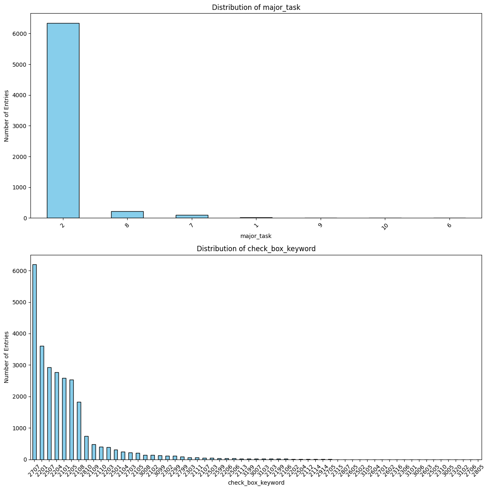
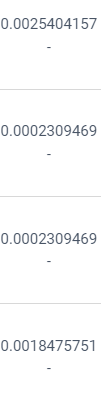

# 제1회 국민대학교 AI 빅데이터 분석 경진대회 ? 이력서 맞춤형 채용공고 추천 AI 모델 개발               <!-- 제목 -->

참여자 : 박사무엘     <!-- 참여자 -->

---

**대회 기간:** 2023.10 ~ 2023.11 (1 month)         <!-- 기간, 도구, 스택 --> 

**사용 언어:** Python Pandas Numpy Matplotlib Scipy LightFM Skcit-learn

---

<br>

## ****대회 개요**** <!-- 개요 와 내가 구현것들을 정리 --> 
이력서, 채용 공고 및 지원 히스토리 데이터를 활용하여 구직자에게 맞춤화된 채용 공고를 자동으로 추천할 수 있는 추천시스템 알고리즘 개발 대회


## 대회 배경       <!-- 배경 --> 

국민대학교 경영대학원 AI빅데이터/디지털마케팅전공과 경영대학에서 ‘제1회 국민대학교 AI빅데이터 분석 경진대회’를 개최합니다.  

이번 대회에서는 Total HR Service를 제공하는 (주)스카우트의 후원을 받아 유연한 노동시장으로의 변화 흐름에 맞추어,  

구직자 입장에서는 자신의 이력과 경력에 맞춤화된 채용 공고를 추천받을 수 있고 구인기업 입장에서는 공고에 적합한 인재를 미리 선별하는 도구로 활용할 수 있도록 채용공고 추천 알고리즘 개발을 제안합니다.  

이력서 등 구직자 관련 데이터와 채용 공고 관련 데이터, 그리고 지원 히스토리 데이터를 활용하여 구직자에게 맞춤화된 채용 공고를 자동으로 추천할 수 있는 알고리즘을 개발함에 따라  

지원자는 적성에 맞는 채용 공고에 지원하여 직무 만족도를 높이고 구인기업은 직종에 맞는 핵심 인재를 선발할 수 있으리라 기대할 수 있습니다  

<br>

### Dataset

- apply_train.csv : 이력서가 채용 공고에 실제 지원한 관계목록(히스토리)
- 이력서 관련 데이터
    + resume.csv : 이력서의 정보 및 희망연봉, 희망직무 및 정보들
    + resume.certificate.csv : 이력서의 자격증 정보
    + resume_education.csv : 이력서의 학력 정보
    + resume_language.csv : 이력서의 어학 정보
- 채용공고 관련 데이터
    + recruitment.csv : 공고 정보가 포함한 근무지, 경력, 학위, 모집 키워드 정보
    + company.csv : 공고 기업의 회사 업종 정보

<br/>

### Evaluation

대회에서는 Recall (재현율)을 기반으로 평가하고 있음  
Recall을 통해 모델이 판단한 것들중 True의 비율을 성적을 파악  
자체적인 평가 코드를 제공함

```python
def recall5(answer_df, submission_df):
    """
    Calculate recall@5 for given dataframes.
    
    Parameters:
    - answer_df: DataFrame containing the ground truth
    - submission_df: DataFrame containing the predictions
    
    Returns:
    - recall: Recall@5 value
    """
    
    primary_col = answer_df.columns[0]
    secondary_col = answer_df.columns[1]
    
    # Check if each primary_col entry has exactly 5 secondary_col predictions
    prediction_counts = submission_df.groupby(primary_col).size()
    if not all(prediction_counts == 5):
        raise ValueError(f"Each {primary_col} should have exactly 5 {secondary_col} predictions.")


    # Check for NULL values in the predicted secondary_col
    if submission_df[secondary_col].isnull().any():
        raise ValueError(f"Predicted {secondary_col} contains NULL values.")
    
    # Check for duplicates in the predicted secondary_col for each primary_col
    duplicated_preds = submission_df.groupby(primary_col).apply(lambda x: x[secondary_col].duplicated().any())
    if duplicated_preds.any():
        raise ValueError(f"Predicted {secondary_col} contains duplicates for some {primary_col}.")


    # Filter the submission dataframe based on the primary_col present in the answer dataframe
    submission_df = submission_df[submission_df[primary_col].isin(answer_df[primary_col])]
    
    # For each primary_col, get the top 5 predicted secondary_col values
    top_5_preds = submission_df.groupby(primary_col).apply(lambda x: x[secondary_col].head(5).tolist()).to_dict()
    
    # Convert the answer_df to a dictionary for easier lookup
    true_dict = answer_df.groupby(primary_col).apply(lambda x: x[secondary_col].tolist()).to_dict()
    
    
    individual_recalls = []
    for key, val in true_dict.items():
        if key in top_5_preds:
            correct_matches = len(set(true_dict[key]) & set(top_5_preds[key]))
            individual_recall = correct_matches / min(len(val), 5) # 공정한 평가를 가능하게 위하여 분모(k)를 'min(len(val), 5)' 로 설정함 
            individual_recalls.append(individual_recall)


    recall = np.mean(individual_recalls)
    
    return recall
```

<br>

## 대회 진행 과정      <!-- 대회의 진행과정 --> 

1. EDA
2. 하이브리드 기반의 추천 모델 개발
3. 모델 방향 개선


<br/>

## 대회 구현 내용  <!-- 대회내에서 의 나의 활동 내용에 대해서는 간단하게 개론의 정도로 --> 

<br><br>

### Libraries

```python
import numpy as np
import pandas as pd
from scipy.io import mmwrite
import os

# all lightfm imports
from lightfm import LightFM
from lightfm.data import Dataset
from lightfm import cross_validation
from sklearn.model_selection import train_test_split
from sklearn.preprocessing import LabelEncoder
from hyperopt import fmin, hp, tpe, Trials
from sklearn.metrics.pairwise import cosine_similarity
from sklearn.decomposition import TruncatedSVD, NMF, SparsePCA

# imports re for text cleaning
import re
from datetime import datetime, timedelta

# we will ignore pandas warning
import warnings
warnings.filterwarnings('ignore')

```

이 대회에서는 위와 같은 라이브러리들을 사용하였음

<br><br><br>

### EDA

- 학력부분에서 이력서의 큰 차이가 보이고, 4년제 대학교들을 졸업한 비중이 우월하게 많았음
```python
# degree 컬럼 분석
# 1. 데이터 타입 확인
degree_data_type = resume_df['degree'].dtypes

# 2. 결측값 여부 확인
degree_missing_values = resume_df['degree'].isnull().sum()

# 3. 고유한 값의 개수 확인
degree_unique_values = resume_df['degree'].value_counts()

print(degree_data_type, degree_missing_values, degree_unique_values)

#---outputs---#
int64 0 degree
4    7453
3     463
5     349
2     211
6       6
Name: count, dtype: int64

```
<br><br>

- 희망연봉은 3,100에서~ 3,400의 범위가 비중이 컸음
```python
# hope_salary에서 0이 아닌 데이터만 선택
hope_salary = resume_df['hope_salary'][resume_df['hope_salary'] > 0]

# 1. 데이터 타입 확인
hope_salary_data_type = hope_salary.dtypes

# 2. 결측값 여부 확인
hope_salary_missing_values = hope_salary.isnull().sum()

# 3. 기술통계치
hope_salary_describe = hope_salary.describe()

# 4. hope_salary의 분포 시각화
plt.figure(figsize=(15, 6))

plt.subplot(1,2,1) 
hope_salary.hist(bins=30, edgecolor='black')
plt.title('Distribution of "hope_salary"')
plt.xlabel('hope_salary')
plt.ylabel('Number of Entries')

plt.subplot(1,2,2)
hope_salary.plot(kind='box', vert=False)
plt.title('Boxplot of "hope_salary"')

plt.tight_layout()
plt.show()

print(hope_salary_data_type, "\n", hope_salary_missing_values, "\n", hope_salary_describe)

# what is average salary?
print(hope_salary.mean())   #--> 3362.6598465473144

```


<br><br>

- 이력서의 희망직군 중 재료·화학·섬유·의복, 디자인, 경영·기획·회계·사무 의 순으로 희망이 높은 것으로 파악
```python
# job_code_seq1 컬럼 값별 빈도수 확인
job_code_seq1_counts = resume_df['job_code_seq1'].value_counts()
job_code_seq1_counts
# 한글 라벨을 영어로 매핑
english_labels = {
    "재료·화학·섬유·의복": "Materials·Chemicals·Fiber·Clothing",
    "디자인": "Design",
    "경영·기획·회계·사무": "Management·Planning·Accounting·Office",
    "영업·판매·TM": "Sales·Sales·TM",
    "건설·기계·전기·전자": "Construction·Machinery·Electric·Electronics",
    "전문·교육·자격": "Professional·Education·Qualification",
    "기타 직종": "Other",
    "IT·게임": "IT·Game",
    "문화·예술·신문·방송": "Culture·Art·Newspaper·Broadcasting"
}

resume_df["job_code_seq1_eng"] = resume_df["job_code_seq1"].map(english_labels)
job_code_seq1_eng_counts = resume_df['job_code_seq1_eng'].value_counts()

a = job_code_seq1_eng_counts.sum()
print("totla number of job code: ", a)

# 파이 차트 그리기
plt.figure(figsize=(12, 12))
pie = job_code_seq1_eng_counts.plot(
    kind='pie',
    autopct='%1.1f%%',
    startangle=90,
    colors=plt.cm.Paired.colors,
    labels=None  # 라벨 숨김
)

# 범례 설정
plt.legend(job_code_seq1_eng_counts.index, title='Job Code ', bbox_to_anchor=(1.05, 1), loc='upper left')

# 제목 설정
plt.title('Distribution of job_code_seq1 values (English Labels)', fontsize=15)

# 그래프 출력
plt.tight_layout()
plt.show()
```


<br><br>

- 공고 정보에서 공고의 직무 키워드를 희망 직무와 연관 짓으려고 노력하였으나 & 가려진 숫자들로만 나온 어려움이 존재 (text_keyword & check_box_keyword & major_task)
```python
# check_box_keyword 컬럼에서 세미콜론을 기준으로 키워드 분리
check_box_keyword_split = recruitment_df['check_box_keyword'].str.split(';', expand=True).stack()
check_box_keyword_split

# major_task 컬럼과 check_box_keyword 컬럼의 키워드를 같이 시각화
plt.figure(figsize=(12, 12))
plt.subplot(2, 1, 1)
recruitment_df['major_task'].value_counts().plot(kind='bar', color='skyblue', edgecolor='black')
plt.title('Distribution of major_task')
plt.xlabel('major_task')
plt.ylabel('Number of Entries')
plt.xticks(rotation=45)

plt.subplot(2, 1, 2)
check_box_keyword_split.value_counts().plot(kind='bar', color='skyblue', edgecolor='black')
plt.title('Distribution of check_box_keyword')
plt.xlabel('check_box_keyword')
plt.ylabel('Number of Entries')
plt.xticks(rotation=45)

plt.tight_layout()
plt.show()

```


- 좀 더 큰 overview를 보기 위해 이력서와 공고 정보를 합쳐 상관계수가 있나 확인도 진행
- 아래의 이유들로 resume_language & resume_certificate & resume_education 의 큰 정보가 없음을 파악
    + 자격증명 == 여러가지 난잡한 이름들로 연관을 짓기 어려움
    + 외국어등 원하는 부분들의 점수와는 다른 것들을 연관 짓기 어려움
    + 마찬가지로 같은 이유들로 학위와 학위 코드들을 연결 짓을 명분을 찾기 어려움

추가적인 EDA는 asset에서 확인 가능

<br><br>

### Hybrid recommand system modeling

대회 초기에 EDA를 통해 이력서(user-based) 와 공고(content-based)의 정보가 충분해 보여 하이브리드를 이용하면 좋은 성적을 거둘것으로 예상  
resume 와 recruitment를 하나로 엮어 하나의 데이터 셋으로 만들어 하이브리드 알고리즘을 이용한 개발을 시작  
resume row > recruitment 여서 결측치는 0 또는 의미가 없는 것들로 채움

- 제공 된 평가식을 LightFM 이라는 framework에 돌아가게끔 바꾸는 방식이 필요
    + 지금 되새겨 보면, 같은 계산이 나온다 하더라도, 평가식을 손을 대는건 매우 위험한 무지한 행동
- 하이브리드가 돌아가게끔 하는데 긴 시간을 넣음

Training
```python
# Define Search Space
trials = Trials()
space = [hp.choice('no_components', range(10, 100, 10)),
         hp.uniform('learning_rate', 0.01, 0.05),
         hp.loguniform('item_alpha', np.log(1e-5), np.log(1e-1)),  # item_alpha 추가
         hp.loguniform('user_alpha', np.log(1e-5), np.log(1e-1)),   # user_alpha 추가
         hp.choice('epochs', [10, 20, 30, 40, 50])  # epochs 추가
         ]

# Define Objective Function
def objective(params):
    no_components, learning_rate, item_alpha, user_alpha, epochs = params

    model = LightFM(no_components=no_components,
                    learning_schedule='adagrad',
                    loss='warp',
                    learning_rate=learning_rate,
                    item_alpha=item_alpha,
                    user_alpha=user_alpha,
                    random_state=1227,)

    model.fit(interactions=train,
              item_features=item_features,
              sample_weight=train_weights,
              epochs=1,
              verbose=False)


    test_recall = test_recall_at_5(model, test, item_features)
    print("no_comp: {}, lrn_rate: {:.4f}, item_alpha: {:.4f}, user_alpha: {:.4f}, epochs: {}, recall: {:.4f}".format(
        no_components, learning_rate, item_alpha, user_alpha, epochs, test_recall))
    output = output = -test_recall

    if np.abs(output+1) < 0.01 or output < -1.0:
        output = 0.0

    return output

#----training----#
model = LightFM(no_components=10,
                    learning_schedule='adagrad',
                    loss='warp',
                    learning_rate=learning_rate,
                    item_alpha=item_alpha,
                    user_alpha=user_alpha,
                    random_state=1227,)

model.fit(interactions=train,
              item_features=item_features,
              sample_weight=train_weights,
              epochs=epochs,
              verbose=False)

# Find Similar Items
# 행렬 생성
item_biases, item_embeddings = model.get_item_representations(features=item_features) # (6695, ), (6695, 2)

```
<br>

학습 후, 둘의 유사도를 이용한 matrix를 생성후 이를 코사인유사도를 구하고 공고를 user에게 추천

<br><br>


검증과 달리 public score는 너무 안좋게 나오는것을 깨달음 허나 하이브리드 개발에 시간이 오래 소비

<br>

이에 나는 기본에 충실하기로 함 이미 유저가 공고를 넣은 items 코사인유사도와  collaborative filtering 알고리즘 사용
추천 순위를 정하는 하이퍼 파라미터를 이용 & 점수를 매겨 추천순위를 정렬하여 추천  

유저와 유저, item과 item들 끼리의 유사도 계산


```python
# 이미 지원한 채용 공고 제외하고 추천
alpha = 0.6
train_recommendations = []
for idx, user in tqdm(enumerate(train_user_item_matrix.index)):
    # 해당 사용자가 지원한 채용 공고
    applied_jobs = set(train_user_item_matrix.loc[user][train_user_item_matrix.loc[user] == 1].index)
    # print(idx, user)

    # 해당 사용자의 추천 점수 ( 높은 점수 부터 정렬 )
    sorted_job_indices = (train_item_predicted_scores.loc[user].values * alpha + train_user_predicted_scores[idx]).argsort()[::-1]
    recommended_jobs = [job for job in train_user_item_matrix.columns[sorted_job_indices] if job not in applied_jobs][:5]

    for job in recommended_jobs:
        train_recommendations.append([user, job])
```
이미 넣은 공고를 제외후, 만든 유사도 행렬을 이용해 공고 유사도 점수와 유저 유사도 점수를 조합하여 우선순위를 만들고 상위 5개를 추천함  
alpha 라는 아이템의 가중치를 조절  
Grid search를 통해 가장 좋은 점수를 내는 alpha 값을 이용하여 제출  

```python
## grid search
# alpha 값의 후보 범위 지정
alpha_values = np.linspace(0, 1, 21)  # 0부터 1까지 0.1 간격으로

best_recall = -1
best_alpha = None

for alpha in tqdm(alpha_values):
    train_recommendations = []

    for idx, user in enumerate(train_user_item_matrix.index):
        # 해당 사용자가 지원한 채용 공고
        applied_jobs = set(train_user_item_matrix.loc[user][train_user_item_matrix.loc[user] == 1].index)

        # 해당 사용자의 추천 점수 ( 높은 점수 부터 정렬 )
        sorted_job_indices = (train_item_predicted_scores.loc[user].values * alpha + train_user_predicted_scores[idx]).argsort()[::-1]
        recommended_jobs = [job for job in train_user_item_matrix.columns[sorted_job_indices] if job not in applied_jobs][:5]

        for job in recommended_jobs:
            train_recommendations.append([user, job])

    # 예측 결과를 DataFrame으로 변환
    val_prediction = pd.DataFrame(train_recommendations, columns=['resume_seq', 'recruitment_seq'])

    # recall 계산
    recall = recall5(val, val_prediction)
    print(f"alpha: {alpha}, recall: {recall}")

    # best_alpha와 best_recall 업데이트
    if recall > best_recall:
        best_recall = recall
        best_alpha = alpha

print(f"Best alpha: {best_alpha}, Best recall: {best_recall}")
```
<br>

최종적으로 validation 보다 0.04 향상 되고, private에서는 0.17166 으로 좀더 향상된 점수로 마감
33/576 Top 6% 획득

---

<br><br><br>

## 대회 한계 및 개선 방안      <!-- 대회 한계 및 개선 방안은 있었는지? (고뇌) -->

**한계**
- EDA 과정에서 독특한 점을 찾기 어려웠음
- 스스로 추천 task에 대해 경험이 부족함
- user-based의 info으로 겹치는 정보들이 많은 반에 비해 연관짓기 어려운 정보들이 존재함 또한 user 와 이을 정보로 item 들의 정보가 숫자로 가려지거나 판단하기 어려운 정보들이 다수 존재하였음
- Hybrid algorithm에 매몰되어 있었던 한계가 스스로 존재했음
- 공유가 되지않아 힘듬. 점수 또한 공고를 12퍼센트 정도 맟추는게 상위권으로 어려운 대회였음

<br>

**개선 방안**
- 1등 solution을 보니 한개의 이상치를 가지고 그부분만을 특화한 학습방식을 채택함
    + 이 처럼 같은 것을 보더라도, 창의적으로 접근한다면 다른 학습방식을 가질 수 있음
- 좀 더 긴 대회였다면, 스스로 다양한 모델의 개선 방향이 있었을 수 도 있었음
- Hybrid AutoML에 꽂히지 말고, 억지로 돌게 하지 않으면, 시간이 더 충분하여 개선할 시간이 주어졌을 가능성이 다분
- Kaggle 과 달리 대회에 참가한 사람들이 오픈소스로 서로 공유하였더라면, 더 대회가 활성화하여 좋은 개선된 모델들이 나올 수 있었을 거 같음
